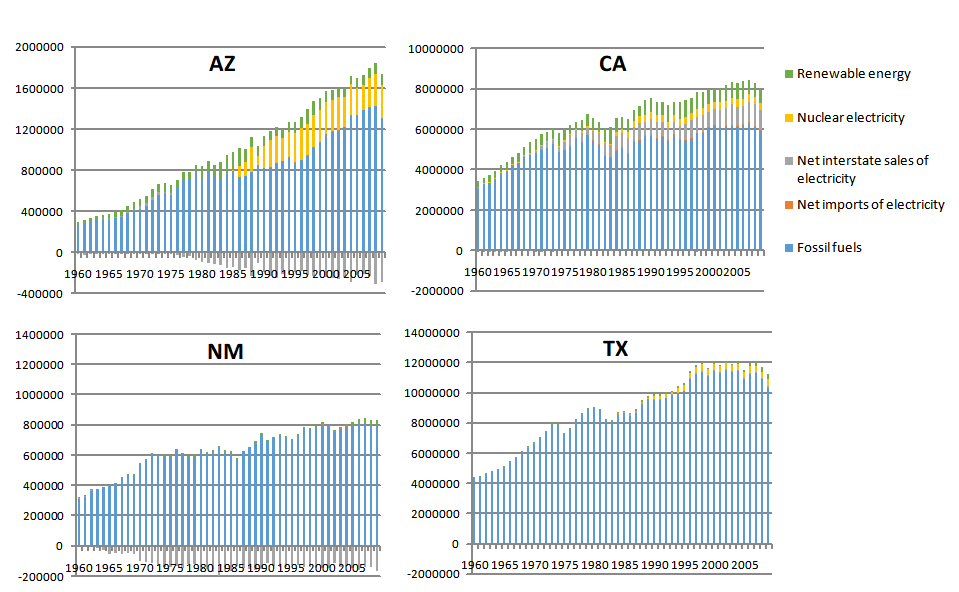
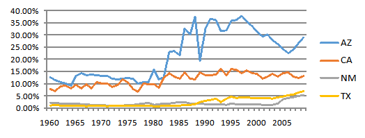
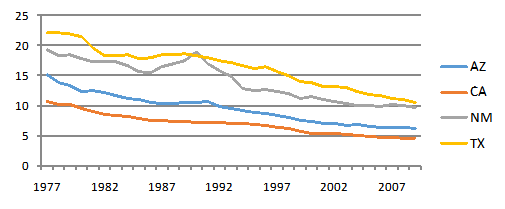
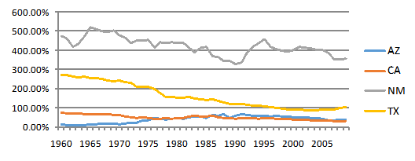
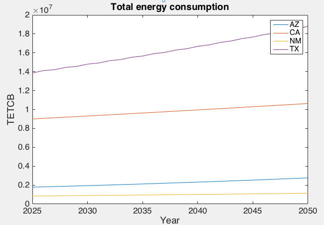
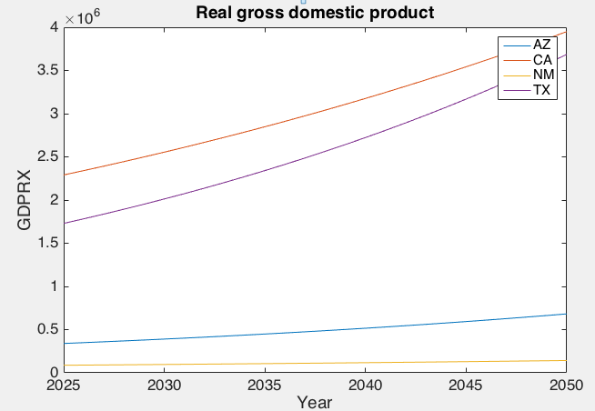
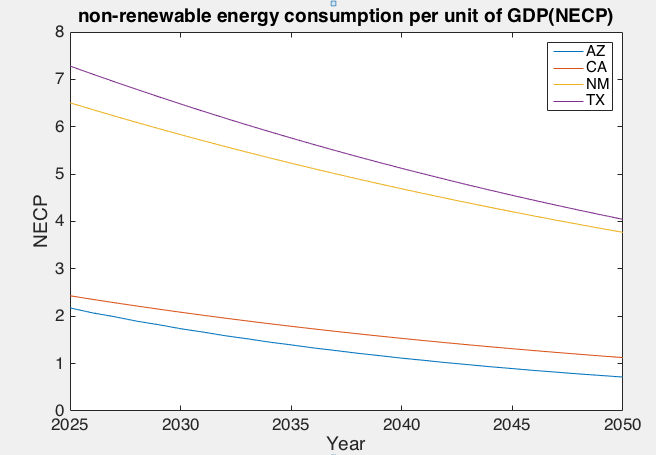

# 2018MCM
**COMAP’s Mathematical Contest in Modeling in February 2018**

**(Note: MathJax Plugin for Github is required in your browser to display the mathematical formulas of this paper)**

**Summary**

In recent years, with the growth of world’s energy demand, energy issue become a
hot spot. Governments are actively seeking cooperation in energy area. However,
it is difficult to analyze energy utilization situation properly in different
regions. In this paper, we establish a series of statistical models to describe
and evaluate the profiles of clean energy of four states. We also give
suggestions for governors to develop cooperative goals.

Firstly, we describe the energy profile of four states. We process and rebuilt the
dataset for observation and evaluation. Based on the dataset, we built several
charts to visualize their energy profiles and the change in decades. Next, to
characterize the evolution of energy profile during 1960-2009, we build a
**Multiple Linear Regression Model.** To judge the efficiency and cleanliness of
energy usage, we choose Non-renewable Energy Consumption Per Unit of GDP (NECP)
as the evaluation criteria and select three tested factors as independent
variables. From calculation results, the coefficients of factors represent
different influence on NECP.

Then, we set a system to evaluate the profile of clean energy. To improve the
reliability of system, we collect some expanded data from authorized websites as
indicators. Our system is based on **Entropy Weight Method** and **Fuzzy
Decision Model** to ensure the weights and values of indicators are measured
properly. We quantify all indicators as triangular fuzzy numbers according to
the established ten-level standard and build the fuzzy decision matrix. Finally,
we rank the clean energy usage of four states: **Arizona\>California\>New
Mexico\>Texas.**

Furthermore, we predict the future energy profile based on **ARIMA Time Series
Model.** With the model we can obtain a more accurate prediction with less data.
After the empirical test for 1960-2009, the $R^{2}$ suggest we have reliable
predictions on GDP, NECP and total energy consumption.

In Part Ⅱ, we set goals from both common side and independent side for four
states based on our prediction and evaluation standard. Finally, at the end of
the paper,

1 Introduction
==============

1.1 Background 
---------------

In recent years, to achieve the goal of sustainable developing, there are four
states of U.S. - California (CA), Arizona (AZ), New Mexico (NM), and Texas (TX)
- that have different industries and varying geographies along the U.S. border
with Mexico, wish to form a realistic new interstate energy compact focused on
increased usage of cleaner, renewable energy sources.

Although many studies have investigated the relation between energy consumption
and economic growth, few studies have paid attention to this relationship by
breaking down the different energy sources and distinguishing by economic
sectors. Therefore, based on the 50 years of statistics data of the four states
provided by [U.S. Energy Information Administration
(EIA)](https://www.eia.gov/), this paper analyzes the production and usage
conditions of energies, develops several models to predict the future
development, and sets goal for future.

1.2 Problem Statement and Motivation 
-------------------------------------

For convenience, we divide the problem into four sub-problems

(1) present the energy profile of the four states

(2) evaluate the usage of renewable energy sources

(3) predict the future energy profile

(4) set renewable energy usage targets for the four states

To tackle the first problem, we select a set of parameters to analyze the data
from developing trends and overall conditions, and rank them among four states.
Then, we choose NECP(non-renewable energy consumption per unit of GDP) to
describe the cleanliness and efficiency of energy usage, using multiple linear
regression to analyze the relation between NECP and three factors, including
RECR (renewable energy consumption ratio), IECR (industrial energy consumption
ratio), and POP (population).

For the second problem, besides attached database, we take the imported
electricity and the emission of main pollutant into account. Based on entropy
weight method, we calculated the weight of each indicator and use fuzzy decision
matrix to build the evaluation model.

As for the third problem, we use ARIMA time series model to predict NECP
(non-renewable energy consumption per unit of GDP). The empirical test with data
from 1960 to 2009 has reliable $R^{2}$, which proves the feasibility of our
model.

And to tackle the forth problem, based on our analyses and predictions, we set
total goals for the compact of four states and independent goals for each state.

2 Assumptions
=============

-   The impact of technological progress is constant.

-   Neglect sharp fluctuations in the short term.

-   All the data collected is actual and believable.

-   New types of energy are not considered.

3 Terminology and Definitions
=============================

| Symbol                             | Definitions                                                                              |
|------------------------------------|------------------------------------------------------------------------------------------|
| GDP                                | Gross Domestic Product                                                                   |
| ESI                                | Energy Security Index, the ratio of total energy production and total energy consumption |
| NECP                               | non-renewable energy consumption per unit of GDP                                         |
| N$\grave{E}$CP | the goal of non-renewable energy consumption per unit of GDP                             |
| TNECP                              | total non-renewable energy consumption per unit of GDP for all four states               |
| EPR                                | energy's real average price                                                              |
| RECR                               | renewable energy consumption ratio in total energy consumption                           |
| REPR                               | renewable energy production ratio in total energy production                             |
| IECR                               | industrial energy consumption ratio in total energy consumption                          |
| POP                                | population                                                                               |
|$R^{2}$                             | goodness-of-fit                                                                          |
| $I_{ij}$                     | The $j^{\text{th}}$ evaluation index of the $I^{\text{th}}$ evaluation object.       |
| $M_{j}^{+}$                         | Fuzzy positive expectation of the $j^{\text{th}}$ evaluation index                     |
| $M_{j}^{-}$                         | Fuzzy negative expectation of the $j^{\text{th}}$ evaluation index                     |
| $w_{j}$                              | The weight of the $j^{\text{th}}$ evaluation index                                     |
| $\mu_{i}$                           | Degree of membership of the $i^{\text{th}}$evaluation object                           |
| *F*                                | Fuzzy index matrix                                                                       |

4 The Energy Profile of four states
===================================

4.1 Building the Profile
------------------------

To have a comprehensive energy profile, we build the profile from two aspects:
the trends and the overall conditions.

Firstly, we use diagrams to describe the trends over 50 years.

Figure 1 Total Energy Consumption Calculated by Fuel Types(unit: Billion Btu)

Figure 1 plot the total energy consumption of four states from 1906-2009. In a
rough view, all the four states have their energy consumption growing in the 50
years, but the consumption of four states decreased almost simultaneously in
some periods of time(around 1974,1981,1994 and 2008).Besides, the usage of
cleaner energy (calculated by the means of nuclear energy and renewable energy)
also keeps growing from 1960 to 2009.

Figure 2 The Proportion of Clean Energy in Total Energy Consumption

Figure 3 Total Energy Consumed per Dollar of Real GDP

(unit: Thousand Btu per chained dollar)

Figure 4 Energy Security Index

(the ratio of total energy production and total energy consumption)

Figure 2,3 and 4 describe some indexes related to production and consumption.

From Figure 2, we can know that the proportion of clean energy consumed is
growing with fluctuation. AZ has the highest proportion while TX has the lowest.

As for the energy consumed per GDP that is described in Figure 3, CA costs least
energy per GDP while TX costs most. But all four states have their costs
decreasing in 50 years(except NM which had its cost increased from 1986 to
1990).

Figure 4 describes the security of energy usage (the dependency on outside
energy). From the figure, NM and TX are typical energy-output states whose
energy production is much larger than consumption. On the contrary, AZ and CA's
energy production is not enough for their energy consumption.

Secondly, to have a overall view, we give each state a profile and rank the
parameters involved out of four states. Data in the profile is describes the
average condition of four states from 1960 to 2009.(e.g. average fossil fuels
proportion = total fossil fuels consumption added from 1960 to 2009 / total
energy consumption added from 1960 to 2009)

| **Arizona(AZ)**                                     |                |          |                              |                |          |
|-----------------------------------------------------|----------------|----------|------------------------------|----------------|----------|
| **Energy Consumption**                              |                |          |                              |                |          |
| by fuel types                                       | **Proportion** | **Rank** | by sectors                   | **Proportion** | **Rank** |
| **Fossil Fuels**                                    | 88.69%         | 3        | **Industrial**               | 21.29%         | 4        |
| **Net imports of electricity**                      | \-0.01%        | 3        | **Transportation**           | 35.35%         | 2        |
| **Net interstate**                                  | \-13.47%       | 3        | **Commercial**               | 20.94%         | 1        |
| **sales of electricity**                            |                |          |                              |                |          |
| **Clean Energy**                                    | 24.79%         | 1        | **Residential**              | 22.43%         | 1        |
| **Other Statistics**                                |                |          |                              |                |          |
|                                                     | **Value**      | **Rank** |                              | **Proportion** | **Rank** |
| **Total energy consumed**                           | 8.41           | 3        | **Energy Security**          | 45.15%         | 4        |
| **per dollar of real GDP**                          |                |          | **Index**                    |                |          |
| **California (CA)**                                 |                |          |                              |                |          |
| **Energy Consumption**                              |                |          |                              |                |          |
| by fuel types                                       | **Proportion** | **Rank** | by sectors                   | **Proportion** | **Rank** |
| **Fossil Fuels**                                    | 79.71%         | 4        | **Industrial**               | 28.10%         | 3        |
| **Net imports of electricity**                      | 0.08%          | 1        | **Transportation**           | 36.52%         | 1        |
| **Net interstate**                                  | 8.14%          | 1        | **Commercial**               | 16.62%         | 2        |
| **sales of electricity**                            |                |          |                              |                |          |
| **Clean Energy**                                    | 12.08%         | 2        | **Residential**              | 18.75%         | 2        |
| **Other Statistics**                                |                |          |                              |                |          |
|                                                     | **Value**      | **Rank** |                              | **Proportion** | **Rank** |
| **Total energy consumed**                           | 15.30          | 1        | **Energy Security**          | 146.33%        | 2        |
| **per dollar of real GDP**                          |                |          | **Index**                    |                |          |
| **New Mexico(NM)**                                  |                |          |                              |                |          |
| **Energy Consumption**                              |                |          |                              |                |          |
| by fuel types                                       | **Proportion** | **Rank** | by sectors                   | **Proportion** | **Rank** |
| **Fossil Fuels**                                    | 120.02%        | 1        | **Industrial**               | 36.15%         | 2        |
| **Net imports of electricity**                      | 0.00%          | 2        | **Transportation**           | 33.68%         | 3        |
| **Net interstate**                                  | \-21.96%       | 4        | **Commercial**               | 15.63%         | 3        |
| **sales of electricity**                            |                |          |                              |                |          |
| **Clean Energy**                                    | 1.95%          | 4        | **Residential**              | 14.54%         | 3        |
| **Other Statistics**                                |                |          |                              |                |          |
|                                                     | **Value**      | **Rank** |                              | **Proportion** | **Rank** |
| **Total energy consumed**                           | 13.03          | 2        | **Energy Security**          | 417.34%        | 1        |
| **per dollar of real GDP**                          |                |          | **Index**                    |                |          |
| **Texas(TX)**                                       |                |          |                              |                |          |
| **Energy Consumption**                              |                |          |                              |                |          |
| by fuel types                                       | **Proportion** | **Rank** | by sectors                   | **Proportion** | **Rank** |
| **Fossil Fuels**                                    | 97.09%         | 2        | **Industrial**               | 57.67%         | 1        |
| **Net imports of electricity**                      | \-0.01%        | 3        | **Transportation**           | 21.21%         | 4        |
| **Net interstate**                                  | 0.13%          | 3        | **Commercial**               | 9.49%          | 4        |
| **sales of electricity**                            |                |          |                              |                |          |
| **Clean Energy**                                    | 2.79%          | 3        | **Residential**              | 11.62%         | 4        |
| **Other Statistics**                                |                |          |                              |                |          |
|                                                     | **Value**      | **Rank** |                              | **Proportion** | **Rank** |
| **Total energy consumed**                           | 15.30          | 1        | **Energy Security**          | 146.33%        | 2        |
| **per dollar of real GDP**                          |                |          | **Index**                    |                |          |

4.2 Analyse the Profile
-----------------------

### 4.2.1 How to measure the energy condition

To build up a model to describe how the energy profile has evolved, we take
three main aspects into account:

(1) the relation between energy condition and the decrease of total energy consumed per dollar of real GDP

(2) the relation between energy condition and the increase of clean energy usage

(3) the relation between energy condition and the negative impact on GDP

Reconsider these relations, we can simplify them into two sides: the GDP growth and the consumption of non-renewable energy and clean energy.

Thus, in this model, we choose non-renewable energy consumption per unit of GDP
(NECP) to describe the cleanliness and efficiency of energy usage. As for the
indicators, to cover all the three aspects above, we choose five factors which
may influence the result, including the energy's real average price (EPR),
renewable energy consumption ratio(RECR), renewable energy production ratio
(REPR),industrial energy consumption ratio (IECR) and population(POP).

### 4.2.2 Multiple Linear Regression

*Step1:* We assume the multiple linear regression between NECP and five factors
as below:

$$
\text{NECP} = \lambda_{1}EPR + \lambda_{2}R\text{ECR} + \lambda_{3}REPR + \lambda_{4}IECR + \lambda_{5}POP + c
$$

To observe the relationship between the non-renewable energy consumption of unit
GDP and these five factors, we should calculate the coefficients of each
factors.

Before calculating the coefficients, to eliminate the numerical influence, we
calculate the average of each factor. The operation makes the coefficients of
factors directly reflect the magnitude of the influence of these factors on
NECP.

Moreover, since we make the same operation to all factors, the coefficients’
relative size keep unchanged, so it will not influence the accuracy of this
model.

*Step2:* We use Matlab to build a multiple linear regression to fit between NECP
and five factors. The coefficients of factors are given in **Table 1**.

Table 1

|    | EPR      | RECR     | REPR     | IECR    | POP       | c       | R\^{2} |
|----|----------|----------|----------|---------|-----------|---------|--------|
| AZ | \-0.5691 | \-4.0392 | \-0.5690 | 2.6114  | \-4.1722  | 13.8363 | 0.9816 |
| CA | \-1.0921 | \-2.8290 | 1.6219   | 1.1731  | \-9.0160  | 16.2443 | 0.9827 |
| NM | \-3.0202 | \-5.9314 | 5.9786   | 0.1205  | \-19.7283 | 36.5023 | 0.9469 |
| TX | \-0.3490 | \-0.8335 | 1.4032   | 12.6452 | \-16.3478 | 19.3998 | 0.9917 |

From the table above, we can find that the relative coefficients of EPR and REPR
are significantly lower in the function. To simplify the model, we removed these
two factors and set up a ternary linear regression model:

$$
\text{NECP} = \lambda_{1}\text{RECR} + \lambda_{2}\text{IECR} + \lambda_{3}\text{POP} + c
$$

Use Matlab to make the fitting again. The new coefficients are given in **Table
2.**

Table2

|    |  $\lambda_{1}$ |  $\lambda_{2}$ |  $\lambda_{3}$ | c       | $R\^{2}$ |
|----|------------------------------------------|------------------------------------------|------------------------------------------|---------|--------|
| AZ | \-3.7445                                 | 2.3860                                   | \-4.0735                                 | 12.5302 | 0.9748 |
| CA | \-1.5186                                 | 3.2052                                   | \-8.0685                                 | 12.4842 | 0.9733 |
| NM | \-0.0132                                 | \-3.3271                                 | \-21.5172                                | 38.7790 | 0.9243 |
| TX | 0.5207                                   | 4.7200                                   | \-19.8066                                | 30.4838 | 0.9865 |

### 4.2.3 The Practical Analysis of Our Factors

-   **Population** is the most significant factor affecting NECP of these four
    states. The NECP of all four states decrease due to the growth of
    population. This is because the increase in the labor force can increase
    GDP, thereby reducing NECP.

-   **Industrial energy consumption ratio** (IECR) of Arizona, California and
    Texas has a negative effect to NECP. Its increase will cause NECP in these
    three states increase, which means the industrial sectors of three states
    still use a lot of non-renewable energy and clean energy ratio is lower.
    While the IECR of New Mexico has a positive effect to NECP, we can think its
    industrial department uses more clean energy than other departments, or
    maybe other departments use too little clean energy. Whatever, the energy
    efficiency of New Mexico is not satisfactory.

-   **Renewable energy consumption ratio** has significant impact on NECP only
    in Arizona. This shows that the energy efficiency of Arizona state is
    stable. And its technology of clean energy is more advanced and mature so
    that the increase in RECR has less impact on energy consumption per unit of
    GDP.

5 Evaluate the Usage of Clean Energy 
=====================================

5.1 Decisive Indicators
-----------------------

Among current studies and documents, we have no authoritative criterion to
assess a state's usage of clean energy. Other than that, the attached database
doesn't have adequate indicators which are directly related to clean energy.

Having considered diverse indicators, we finally decide nine indicators which
are related to the usage condition of clean energy, as given in **Table 3.** We
classify the indicators into two types: positive indicators(which have positive
relation with the usage of clean energy) and negative indicators(which have
negative relation).

Table 3

|       | Definition                                                                                                            | Unit                | Type     |
|-------|-----------------------------------------------------------------------------------------------------------------------|---------------------|----------|
| $I_{1}$ | Total Energy Consumed per Dollar of Real GDP                                                                          | MMBtu/\$            | Negative |
| $I_{2}$ | Consumption of Renewable Energy                                                                                       | Billion Btu         | Positive |
| $I_{3}$ | Consumption of Nuclear Energy                                                                                         | Billion Btu         | Positive |
| $I_{4}$ | Consumption of Electricity Outside the State (add net imports of electricity and net interstate sales of electricity) | Billion Btu         | Positive |
| $I_{5}$ | Growth Rate of Renewable Energy(2008-2009)                                                                            | Percent             | Positive |
| $I_{6}$ | Growth Rate of Nuclear Electricity (2008-2009)                                                                        | Percent             | Positive |
| $I_{7}$ | Emission of $\text{CO}_{2}$                                                                                         | Million metric tons | Negative |
| $I_{8}$| The Percentage of $\text{NO}_{x}$ Emission in US Total $\text{NO}_{x}$ Emission                                   | Percent             | Negative |
| $I_{9}$ | The Percentage of Sulfides Emission in US Total Sulfides Emission                                                     | Percent             | Negative |

5.2 Determine the Weight of Indicators Base on Entropy Weight Method
--------------------------------------------------------------------

To determine the value of indicators in evaluation, we use entropy weight method
to standardize the dispersion degree of different indicators into values between
0 to 1.

Assume there are **n states and m indicators**, we use $I_{\text{ij}}$ to
describe the $i^{\text{th}}$ state under the $j^{\text{th}}$ indicator.
(*i*=1,2,3,n; *j*=1,2,...,m)

For positive indicators,

$$
I_{\text{ij}}^{'} = \frac{I_{\text{ij}} - \operatorname{}\left\{ I_{1j},\cdots,I_{\text{ij}} \right\}}{\operatorname{}{\left\{ I_{1j},\cdots,I_{\text{ij}} \right\} -}\operatorname{}\left\{ I_{1j},\cdots,I_{\text{ij}} \right\}}
$$

For negative indicators,

$$
I_{\text{ij}}^{'} = \frac{\operatorname{}\left\{ I_{1j},\cdots,I_{\text{ij}} \right\} - I_{\text{ij}}}{\operatorname{}{\left\{ I_{1j},\cdots,I_{\text{ij}} \right\} -}\operatorname{}\left\{ I_{1j},\cdots,I_{\text{ij}} \right\}}
$$

(To simplify writing, we still use $I_{\text{ij}}$ to describe the results
$I_{\text{ij}}^{'}$ )

Use $P_{\text{ij}}$ to describe the proportion of sample *i* (the
$i^{\text{th}}$ state ) under the $j^{\text{th}}$ indicator

$$
p_{\text{ij}} = \frac{I_{\text{ij}}}{\sum_{i = 1}^{n}I_{\text{ij}}}
$$

Then, calculate the entropy of $I_{j}$,

$$
e_{j} = - k\sum_{i = 1}^{n}{p_{\text{ij}}\ln\left( p_{\text{ij}} \right)}
$$

($$k = \frac{1}{\ln\left( n \right)}$$ to ensure $e_{j} \geq 0$)

The diversity of entropy is

$$
d_{j} = 1 - e_{j}
$$

and the value of indicator *j* is

$$
w_{j} = \frac{d_{j}}{\sum_{j = 1}^{m}d_{j}}
$$

In this problem, there are four states and nine indicators.

Set **n = 4 and m = 9**, then we input the data into a Matlab program that
calculates the weight of each indicator, as given in **Table 4.**

Table 4

| Indicator | $I_{1}$ | $I_{2}$  | $I_{3}$  | $I_{4}$  | $I_{5}$  | $I_{6}$  | $I_{7}$  | $I_{8}$  | $I_{9}$  |
|-----------|--------|--------|--------|--------|--------|--------|--------|--------|--------|
| Weight    | 0.1323 | 0.1536 | 0.0814 | 0.1764 | 0.0879 | 0.1073 | 0.1008 | 0.0813 | 0.0790 |

5.3 Evaluation Based on the Fuzzy Decision Model
------------------------------------------------

To calculate the priority of indicators, we use fuzzy decision algorithm, along
with the weights based on entropy method to build the model.

*Step 1:* Quantify primary evaluation degrees from 1 to 10 and build up a
standard to match degrees and triangular fuzzy numbers. The standard is given in
**Table 5**. The symbol of evaluation degree is written as *h* (*h*=1,2,...,10)
while triangular fuzzy number is written as *f*.

Table 5

| Degree (*h*)                   | 1            | 2            | 3            | 4            | 5              |
|--------------------------------|--------------|--------------|--------------|--------------|----------------|
| Quantified Fuzzy Numbers (*f*) | （5,10,15）  | （15,20,25） | （25,30,35） | （35,40,45） | （45,50,55）   |
| Degree (*h*)                   | 6            | 7            | 8            | 9            | 10             |
| Quantified Fuzzy Number (f)    | （55,60,65） | （65,70,75） | （75,80,85） | （85,90,95） | （95,100,105） |

*Step 2:*Build a $n \times m$ fuzzy indicator matrix *I* in which
$I_{\text{ij}}$ is the $j^{\text{th}}$ indicator of the $i^{\text{th}}$
state. Set up 10 evaluation degrees, which are written as *h* (*h*=1,2,...,10).

For the $j^{\text{th}}$column, introduce discrimination value *a*,

$$
a_{\text{ij}} = \frac{I_{\text{ij}} - \operatorname{}I_{j}}{\operatorname{}I_{j} - \operatorname{}I_{j}}
$$

if $$a_{\text{ij}} \in \left\lbrack \frac{h - 1}{10},\frac{h}{10}
\right\rbrack$$,the primary evaluation degree of $I_{\text{ij}}$ is *h*.

From the relation between *h* and *f* in Table 3, we can quantify the
corresponding triangular fuzzy number $f_{\text{ij}}$. Then build the matrix
of triangular fuzzy numbers

$$
F = {(f_{\text{ij}})}_{m \times n}
$$

Standardize *F* to build the standardized matrix of triangular fuzzy numbers

$$
R = {(y_{\text{ij}})}_{m \times n}
$$

*Step 3:*Build the triangular fuzzy numbers of indicator's weight in Table 2.
Combine them as a vector *w*.

$$
w = \left\lbrack \left( w_{1},w_{1},w_{1} \right),\left( w_{2},w_{2},w_{2} \right),\cdots,\left( w_{m},w_{m},w_{m} \right) \right\rbrack
$$

(m is the total number of states)

Then, weighted the standardized matrix *R*, and we get the fuzzy decision matrix

$D = {(r_{\text{ij}})}_{m \times n}$ ,

in which
$$r_{\text{ij}} = w_{j}{\Theta}y_{\text{ij}} =
(w_{j}^{(1)}y_{\text{ij}}^{\left( 1 \right)},w_{j}^{(2)}y_{\text{ij}}^{\left( 2
\right)},w_{j}^{(3)}y_{\text{ij}}^{\left( 3 \right)})$$

(*i=*1,2,...,*n*; *j*=1,2,...,*m*)

*Step 4:* We use $M^{+}$ to describe the fuzzy positive ideal and $M^{-}$ to
describe the fuzzy negative ideal.

$$M^{+} = (M_{1}^{+},M_{2}^{+},\ldots,M_{3j}^{+})$$, $$M^{-} =
(M_{1}^{-},M_{2}^{-},\ldots,M_{3j}^{-})$$

The component $$M_{j}^{+} = \operatorname{}\left\{
r_{1j},r_{2j},\ldots,r_{\text{nj}} \right\}$$ is the maximum fuzzy number among
the fuzzy numbers of column *j* in the fuzzy decision matrix *D*, and
$$M_{j}^{-} = \operatorname{}\left\{ r_{1j},r_{2j},\ldots,r_{\text{nj}}
\right\}$$ is the minimum fuzzy number among the fuzzy numbers of the
$j^{\text{th}}$column in the fuzzy decision matrix *D*.

Then, we build equations to calculate the distance between condition of state
*i* and $M^{+}$,$\ M^{-}$. Use $d_{i}^{+}$ and $d_{i}^{-}$ to symbolize
them.

$$d_{i}^{+} = \sqrt{\sum_{j = 1}^{3j}{(r_{\text{ij}} - M_{j}^{+})}^{2}}$$ ,
$$d_{i}^{-} = \sqrt{\sum_{j = 1}^{3j}{(r_{\text{ij}} - M_{j}^{-})}^{2}}$$ ,
*i*=1,2,...,*n*

*Step 5:* Assume the membership degree between the $i^{\text{th}}$state and
fuzzy positive ideal $M^{+}$ is $\mu_{i}$.

$$
\mu_{i} = \frac{d_{i}^{-}}{d_{i}^{+} + d_{i}^{-}}
$$

(*i=*1,2,...,*n*)

In this problem, there are four states and nine indicators.

Set **n = 4 and m = 9**, then we input the data into a Matlab program, the
results are given in **Table 6**.

Table 6

|            | Arizona (AZ) | California (CA) | New Mexico (NM) | Texas (TX) |
|------------|--------------|-----------------|-----------------|------------|
| $d_{i}^{+}$ | 0.2472       | 0.2977          | 0.3382          | 0.3380     |
|$d_{i}^{-}$ | 0.4118       | 0.3846          | 0.3582          | 0.2985     |
|$\mu_{i}$   | 0.6249       | 0.5637          | 0.5144          | 0.4690     |

Since $\mu_{i}$ has positive relation with the evaluation of the usage of
clean energy, we can rank the usage of clean energy among four states from best
to worst:

AZ\>CA\>NM\>TX

**Arizona has the best profile of clean energy.**

6 Predict the Future Energy Profile
===================================

6.1 Prediction Based on the ARIMA Time Series Model
---------------------------------------------------

Considering that we have no future data of the indicators used in the evaluation
of part 5, if we use previous model to evaluate future energy condition
indirectly, the error of prediction cannot be neglected. So in this question, we
use ARIMA(p,D,q) model of total energy consumption, real GDP, and
NECP(non-renewable energy consumption per unit of GDP) to predict the energy
profile of each state from 2025 to 2050.

ARIMA(p,D,q) time series model calculates D-order difference of the data, then
the model puts the data into equation ARMA(p,q) :

$$
X_{t} = \varphi_{1}X_{t - 1} + \cdots + \varphi_{p}X_{t - p} + a_{t} - \theta_{1}a_{t - 1} - \cdots - \theta_{t - q}a_{t - q}
$$

($X_{t}$:the time series after calculation of D-order difference; $a_{t}$:
white noise sequence )

With a Matlab program, first, we build the ARIMA(p,D,q) time series model of
total energy consumption for each state.Based on the model, we predict the NECP
from 2025 to 2050 for each state, as plotted in **Figure 5**.

Figure 5

Using data from 1960-2009 to have a empirical test in Matlab, we have the
goodness-of-fit, as given in Table 5. From **Table 7** we can know that the time
series model fits the data well.

Table 7

| State                                     | AZ     | CA     | NM     | TX     |
|-------------------------------------------|--------|--------|--------|--------|
| ${R}^{2}$ | 0.9947 | 0.9876 | 0.9665 | 0.9880 |

And the prediction of total energy consumption in 2025 and 2050 is given in
**Table 8**.

Table 8

|    | 2025                   | 2050                   |
|----|------------------------|------------------------|
| AZ | 1.7384 $\times 10^{6}$ | 2.7676 $\times 10^{6}$ |
| CA | 0.9001 $\times 10^{7}$ | 1.0637 $\times 10^{7}$|
| NM | 0.8474 $\times 10^{6}$ | 1.1435 $\times 10^{6}$ |
| TX | 1.3867 $\times 10^{7}$  | 1.8802 $\times 10^{7}$ |

According to our prediction, Texas(TX)'s will have the most total energy
consumption and fastest growth, Mexico(NM)’s condition is similar to
Arizona(AZ), using less energy.

Secondly, we do the same work for the real GDP from 2025 to 2050, as plotted in
**Figure 6**.

Figure 6

The goodness-of-fit of empirical test:

Table 9

| State                                     | AZ     | CA     | NM     | TX     |
|-------------------------------------------|--------|--------|--------|--------|
| ${R}^{2}$  | 0.9969 | 0.9956 | 0.9932 | 0.9944 |

And the real GDP prediction in 2025 and 2050 is given in **Table 10**

Table 10

|    | 2025                   | 2050                   |
|----|------------------------|------------------------|
| AZ | 3.3975 $\times 10^{5}$ | 6.8204 $\times 10^{5}$ |
| CA | 2.2906 $\times 10^{6}$ | 3.9502 $\times 10^{6}$ |
| NM | 0.8757 $\times 10^{5}$ | 1.4257 $\times 10^{5}$ |
| TX | 1.7297 $\times 10^{6}$  | 3.6867 $\times 10^{6}$ |

According to our prediction, California(CA)'s and Texas(TX)'s GDP will have the
best GDP development. New Mexico(NM)’s situation is worrying.

Finally, to describe the usage of clean energy, we build the ARIMA(p,D,q) time
series model of NECP(non-renewable energy consumption per unit of GDP). The
prediction from 2025 to 2050 for each state is plotted in **Figure 7**.

Figure 7

The goodness-of-fit of empirical test is given in Table 11.

Table 11

| State                                  | AZ     | CA     | NM     | TX     |
|----------------------------------------|--------|--------|--------|--------|
| ${R}^{2}$  | 0.9574 | 0.9885 | 0.9569 | 0.9863 |

And the non-renewable energy consumption per unit of GDP in 2025 and 2050 is
given in **Table 12**.

Table 12

|    | 2025   | 2050   |
|----|--------|--------|
| AZ | 2.1768 | 0.7163 |
| CA | 2.4320 | 1.1270 |
| NM | 6.5052 | 3.7710 |
| TX | 7.2809 | 4.0455 |

According to our prediction, Arizona(AZ) has the best usage of clean energy,
California(CA)'s condition is similar to AZ, while New Mexico(NM) and
Texas(TX)'s condition is worse.

7 Set up Goals for Future
=========================

7.1 Goals Setting
-----------------

### 7.1.1 Total goals

To determine the overall level of energy consumption, we calculated the total
non-renewable energy consumption per unit of GDP for all four states (TNECP),
that is, each states’ NECP multiplied by GDP, divided by the total GDP of the
four states. Then, using the ARIMA (p, D, q) model again, establish a time
series model of TNECP and predict the TNECP of 2025 and 2050: 3.9572, 1.9776.

The goal of the energy contract is to achieve a win-win situation of energy and
economic development in all four states. After the formation of the contract,
technology sharing and reduction of barriers to energy import and export will
inevitably lead to the convergence of the NECP of the four states. The states’
GDP growth rate of all four states will increase, and the rate of reduction of
NECP will be faster. However, least developed states will receive more new
technology，which means GDP growth and NECP reduction will be faster than
technology more mature states. Then, under this converging trend, the NECP
arithmetic average of the four states will tend to tighten to the TNECP. Of
course, NECP’s arithmetic average can’t be exactly equal to the TNECP, because
GDP and NECP will be affected by various factors. However, under the contract,
the arithmetic mean is likely to reach the TNECP predictive value.

Currently, the average forecast of the four states’ NECP in 2025 and 2050 is
4.5987, 2.4149. We can set the TNECP projections in 2050 as the target for the
four states’ NECP arithmetic mean in 2050. Suppose that this rate of approach to
the total NECP predictions is equal year by year, then since the contract
started in 2010, by 2025, the difference between NECP average and TNECP forecast
should aim to reduce 37.5%, based on the original forecast.

Table 13

|            | 2025   | 2050   |
|------------|--------|--------|
| prediction | 4.5987 | 2.4149 |
| goals      | 4.3581 | 1.9776 |

### 7.1.2 States goals

Using total goals as the general objective of the contract, we can calculate the
respective goals of each state in a converging trend. Taking the NECP of the
four states in 2009 as the parameter, that is, the higher the unit NECP in 2009
is, the larger the difference between the predicted value and the target value
is. We can get the following model:

$$
4\varepsilon = \omega_{1}{\text{NECP}}_{\text{AZ}} + \omega_{2}{\text{NECP}}_{\text{CA}} + \omega_{3}{\text{NECP}}_{\text{NM}} + \omega_{4}{\text{NECP}}_{\text{TX}}
$$

(ε represents the difference between the predicted mean NECP and the target
average NECP)

According to the data of 2009, we get the coefficient:

Table 14

| $\omega_{1}$ | $\omega_{2}$ | $\omega_{3}$  | $\omega_{4}$ |
|---------------------------|---------------------------------|---------------------------|---------------------------|
| 0.1622                    | 0.1457                          | 0.3340                    | 0.3581                    |

Using these coefficient, calculate the states goals in 2025

Table 15

|      | AZ     | CA     | NM     | TX     |
|------|--------|--------|--------|--------|
| NECP | 2.0207 | 2.2918 | 6.1838 | 6.9363 |

And the states goals in 2050

Table 16

|      | AZ     | CA     | NM     | TX     |
|------|--------|--------|--------|--------|
| NECP | 0.4326 | 0.8721 | 3.2769 | 3.4191 |

7.2 The Policy Advice for Governments
-------------------------------------

Next, we give each state three certain actions and some other actions. The most
important part of the contract is technology sharing and reducing resource
transportation costs, which can bring fastest reduction of NECP. For the four
states, we can calculate the specific requirements of the three factors based on
the model established.

$$
\text{NECP} = \lambda_{1}\text{RECR} + \lambda_{2}\text{IECR} + \lambda_{3}\text{POP} + c
$$

We assume that the difficulty of changing the three factors is equal, and the
greater the change, the harder it will be to change, so we will consider to
accomplish the goal by changing the same rate of the three factors，and we hope
all three factors will move in a favorable direction. So we can establish the
following equation：

$$
\overset{\grave{}}{\text{NECP}_{t}} = \left( 1 \pm x \right)^{t - 2010}(\lambda_{1}\text{RECR}_{2009} + \lambda_{2}\text{IECR}_{2009} + \lambda_{3}\text{POP}_{2009}) + c
$$

($\overset{\grave{}}{\text{NECP}_{t}}$ is the goal of NECP in
$t^{\text{th}}$year, the sign of the coefficient of X is the opposite of
$\lambda_{i}$)

Using Matlab, we can get the certain number of X. If each of the state want to
achieve the goal in 2025, their factors annual change rate on average between
2010-2025 should be:

Table 17

|    | RECR  | IECR    | POP   |
|----|-------|---------|-------|
| AZ | 2.41% | \-2.41% | 2.41% |
| CA | 1.65% | \-1.65% | 1.65% |
| NM | 1.11% | 1.11%   | 1.11% |
| TX | 0.16% | \-0.16% | 0.16% |

If each of the state want to achieve the goal in 2050, their factors annual
change rate on average between 2010-2050 should be:

Table 18

|    | RECR  | IECR    | POP   |
|----|-------|---------|-------|
| AZ | 1.20% | \-1.20% | 1.20% |
| CA | 0.86% | \-0.86% | 0.86% |
| NM | 0.63% | 0.63%   | 0.63% |
| TX | 0.35% | \-0.35% | 0.35% |

8 Conclusions
=============

AZ and CA have the better energy profile. AZ has the highest proportion of clean
energy in total energy consumption, while CA has the best energy efficiency. NM
has a terrible clean energy profile with the highest energy security index, and
TX has the worst efficiency. Population (POP), proportion of renewable energy in
total energy consumption (PREC), proportion of industrial in total energy
consumption (IREC) significantly affected non-renewable energy consumption per
unit of GDP (NPEC). Based on Data in 2009, AZ has the best clean energy profile.
Without any new policy, AZ and CA will still have the best usage of clean energy
from 2025 to 2050 and the situation of NM is worrying.

Our suggestion is having NECP’s arithmetic average reduced to 4.3581 thousand Btu
per dollar by 2025 and reduced to 1.9776 thousand Btu per dollar by 2050 as the
total goal of all four states. And for each state, the higher the NECP in 2009
is, the larger the difference between the predicted value and the target value
is. Governors can achieve goals by controlling PERC, IREC, POP change to be a
same rate.

9 Strengths and Weaknesses
==========================

-   **Strengths**

Our multiple linear regression model removes the effect of numerical size, and
we also consider the goodness of fit, so our model is acceptable.

In evaluating the usage of clean energy, we use entropyweightmethod (EWM) to
give a weight vector of indicators. This avoids the error of subjective
assignment and improve the accuracy of our model.

In the establishment of triangular fuzzy Numbers, we adopt the unified index
quantification standard. It excludes the influence of the numerical size. So,
our evaluation system is objective and credible.

-   **Weaknesses**

In our multiple linear regression model, we choose the factors subjectively, so
the factors are not comprehensive.

Our evaluation system of usage of clean energy only has nine indicators. It not
cover all factors influencing the result.

10 A Memo to Governors
======================

-   **Energy profile**

From 1960 to 2009，Arizona(AZ) and California(CA) have better energy profiles,
while situations of New Mexico(NM) and Texas(TX) are unsatisfying. NM has the
highest energy security index, which may lead to its terrible energy efficiency
and low usage of clean energy. TX has the worst energy efficiency. AZ has the
highest proportion of clean energy in total energy consumption(RER), while CA
has the lowest energy consumption per unit of GDP. AZ and CA have less
non-renewable energy consumption per unit of GDP(NECP) than other two states.
But almost all four states have their costs decreasing in 1960-2009.

Considering the features that affect NECP，population is the most powerful
features for all four states. Population growth means the reduction of NECP. At
the same time, the proportion of renewable energy in total energy consumption
(RECR) significantly affect the NECP of AZ. And proportion of industrial sector
in total energy consumption (IECR) significantly affected the NECP of CA.

-   **Energy profile prediction**

Using the ARIMA(p, D, q) model to predict the GDP, total energy
consumption(TETCB) and NECP without any new policy. AZ and CA will still have
the best usage of clean energy, and CA and TX will have the best GDP
development. However, the NECP of TX is too high, besides, TX will have the
largest total energy consumption and fastest energy consumption growth. NM will
have the worst situation, meaning the necessity of its policy changes..

-   **Total goals**

Based on the predictions of NECP and TNECP of all four states, we suggest the
total goal of all four states’ average NECP reduces to 4.3581 by 2025 and
reduces to 1.9776 by 2050.

Reference
=========

[1] Zhi-hong, ZOU, Yi , YUN, Jing-nan SUN. Entropy method for determination of
weight of evaluating indicators in fuzzy synthetic evaluation for water quality
assessment[J]. Journal of Environmental Sciences,2006,18(5).

[2] RajendranVidhya, Rajkumar Irene Hepzibah. A comparative study on interval
arithmetic operations with intuitionistic fuzzy numbers for solving an
intuitionistic fuzzy multi–objective linear programming problem[J].
International Journal of Applied Mathematics and Computer Science,2017,27(3).

[3] Adam Grabowski. The Formal Construction of Fuzzy Numbers[J]. Formalized
Mathematics,2015,22(4).

[4] Lei Ming. Research on energy consumption structure in China [D]. Shanghai
jiaotong university,2007.

[5] Zhang Wei, Wu Wenyuan. Research on the energy efficiency of the whole
element of the metropolitan area based on environmental performance [J].
Economic research,2011,46(10):95-109.

[6] Wang Guangqing. Research on Regional Sustainable Development Theory and
Decision-Supporting System [D]. TIANJIN: Tianjin University, 2004.

[7] BP, British Petroleum, Statistical Review of World Energy, 2010.

[8] IEA, International Energy Agency, CO2 emissions from fuel combustion, 2014.

[9] <https://www.eia.gov/>U.S. Energy Information Administration (EIA)

